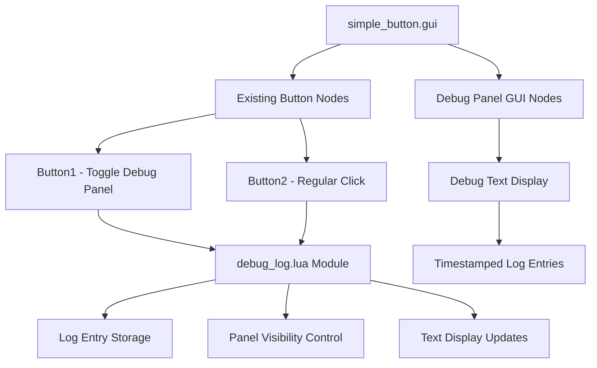
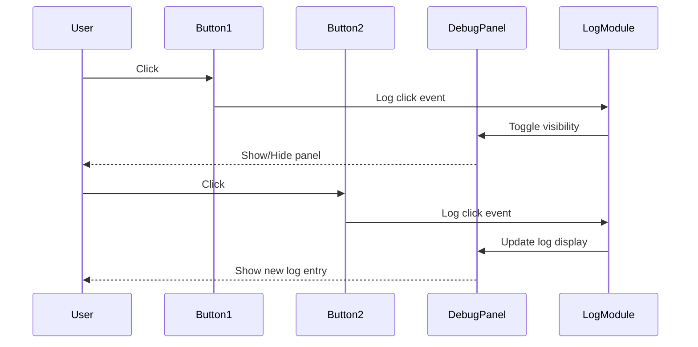

# Debug Log Panel Proposal for Simple Button Example

## Overview
This proposal adds a toggleable debug text log panel to the simple_button example, making button interactions visible in HTML5 builds where console output isn't accessible.

## Implementation Plan

### Architecture Diagram

### Key Components

1. **Debug Panel GUI Elements**
   - Container node positioned in top-right corner
   - Text display node for log entries
   - Initially hidden, toggled by button1

2. **debug_log.lua Module**
   - Manages log entry storage with timestamps
   - Controls panel visibility state
   - Formats and updates text display
   - Provides toggle and logging functions

3. **Enhanced Button Callbacks**
   - Button1: Toggles debug panel + logs click
   - Button2: Logs click only
   - Both maintain existing console output

### User Experience Flow

## Files to be Modified/Created

### New Files
- `examples/simple_button/simple_button/debug_log.lua` - Debug log management module

### Modified Files
- `examples/simple_button/simple_button/simple_button.gui` - Add debug panel GUI nodes
- `examples/simple_button/simple_button/simple_button.gui_script` - Integrate debug functionality

## Benefits
1. **Educational Value**: Makes button interactions visible in HTML5 demos
2. **Debugging Aid**: Provides real-time feedback for user interactions
3. **Non-Intrusive**: Maintains existing functionality while adding new features
4. **Reusable**: Debug module can be adapted for other examples

## Next Steps
1. Review and approve this proposal
2. Switch to code mode to implement the changes
3. Follow the tasks.md checklist for implementation
4. Test in both Defold editor and HTML5 builds